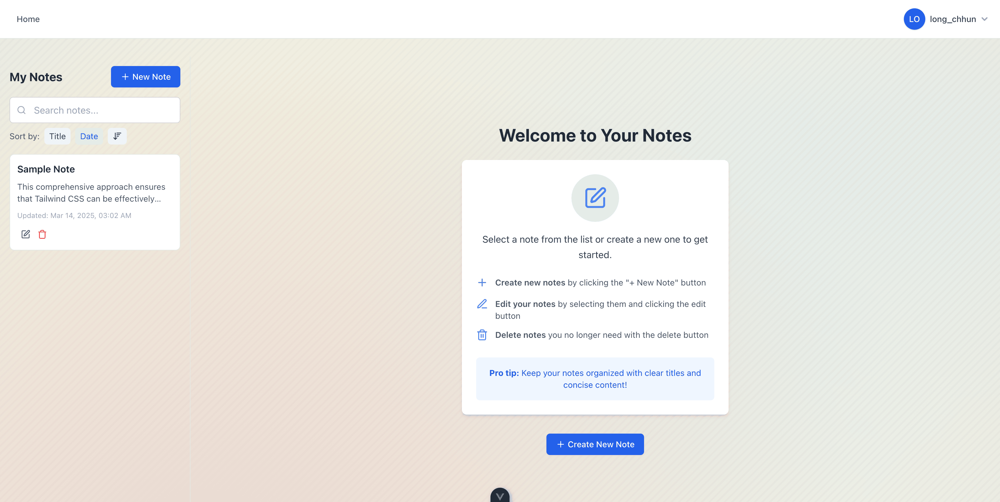

# Note App

A modern, full-stack note-taking application built with .NET 8 and Vue.js.



## Features

- **User Authentication**: Secure sign-up, login, and token-based authentication
- **Note Management**: Create, read, update, and delete personal notes
- **Rich Text Editing**: Format your notes with a user-friendly editor
- **Responsive Design**: Works on desktop and mobile devices
- **Real-time Validation**: Instant feedback on user inputs
- **Secure API**: JWT-based API with proper authorization

## Tech Stack

### Backend
- **.NET 8**: Latest .NET framework for building modern, high-performance APIs
- **Entity Framework Core**: ORM for database interactions
- **ASP.NET Core Identity**: Authentication and authorization
- **Swagger/OpenAPI**: API documentation and testing
- **Microsoft SQL Server**: Database storage

### Frontend
- **Vue.js 3**: Progressive JavaScript framework with Composition API
- **Pinia**: State management for Vue applications
- **Vue Router**: Navigation and routing
- **Tailwind CSS**: Utility-first CSS framework for styling
- **Axios**: HTTP client for API requests

## Architecture Overview

The application follows a modern client-server architecture:

```
┌─────────────────┐       ┌─────────────────┐       ┌─────────────────┐
│                 │       │                 │       │                 │
│    Vue.js       │◄─────►│    ASP.NET      │◄─────►│   SQL Server    │
│    Frontend     │  API  │    Backend      │  EF   │   Database      │
│                 │       │                 │       │                 │
└─────────────────┘       └─────────────────┘       └─────────────────┘
```

For more details, see the [Architecture Documentation](ARCHITECTURE.md).

## Setup Instructions

### Prerequisites
- [.NET SDK 8.0](https://dotnet.microsoft.com/download) or later
- [Node.js](https://nodejs.org/) (v16 or later)
- [SQL Server](https://www.microsoft.com/en-us/sql-server/sql-server-downloads) (or SQL Server Express)

### Backend Setup

1. Navigate to the backend directory:
   ```
   cd backend/NoteApi
   ```

2. Restore the .NET packages:
   ```
   dotnet restore
   ```

3. Update the database connection string in `appsettings.json` or `appsettings.Development.json`

4. Apply migrations to create the database:
   ```
   dotnet ef database update
   ```

5. Run the application:
   ```
   dotnet run
   ```

The API will be available at `http://localhost:5289`.

### Frontend Setup

1. Navigate to the frontend directory:
   ```
   cd frontend/note-app
   ```

2. Install the dependencies:
   ```
   npm install
   ```

3. Create a `.env` file with the following content:
   ```
   VITE_API_URL=http://localhost:5289/api
   ```

4. Start the development server:
   ```
   npm run dev
   ```

The application will be available at `http://localhost:5173`.

## Running the Application

1. Start the backend server (if not already running):
   ```
   cd backend/NoteApi
   dotnet run
   ```

2. Start the frontend development server (in a separate terminal):
   ```
   cd frontend/note-app
   npm run dev
   ```

3. Open your browser and navigate to `http://localhost:5173`

4. Register a new account or log in with existing credentials

## Screenshots

*Screenshots will be added soon.*

## API Documentation

The API documentation is available via Swagger when the backend is running:

- Development: `http://localhost:5289/swagger`

For a detailed description of all endpoints, see the [API Documentation](API.md).

## Contributing

Contributions are welcome! Please see the [Contributing Guidelines](CONTRIBUTING.md) for more information.

## License

This project is licensed under the MIT License - see the [LICENSE](LICENSE) file for details.

